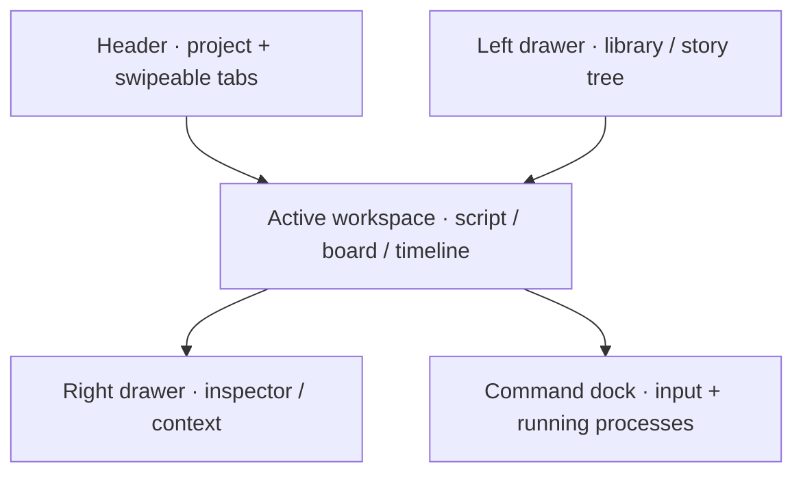

# CA_0002_BUILD_technical-architecture-and-workspace-shell

Status: completed

Requested: 2026-08-29

## Intent

Give this repo the same complete technical foundation and workspace shell as
`studio`, combining the full scope of `ST_0001_BUILD_technical-architecture`
and `ST_0002_FEAT_workspace-shell` into one ordered change.

The foundation is one containerized stack of Postgres, Garage, and a Qwik +
Qwik City application, run through Docker Compose in development with the
application itself in a container and hot-reloading. The stack is reached from
the developer's machine over the Tailscale network at `100.114.122.91`.

On that foundation, scaffold the `Calliopa` web application as a responsive,
multi-tab workspace shell that feels like a modern video-editing suite adapted
for story development: dense but calm, cinematic, and focused on moving
narrative material through a workflow.

The shell is the frame every later tool mounts into. It owns layout, drawers,
tabs, the command dock, theming, the process registry, and global drag
coordination. It does not decide the content model; script, storyboard, and
timeline tools arrive in their own changes.

The technical foundation is implemented and verified before the workspace
shell tasks begin.

## Source Adaptations

- The complete architecture and workspace-shell scope is retained from the two Studio changes.
- Repository-local identifiers are adapted from `studio`, `Calliopa-Studio`, `ST`, and `STUDIO_` to `calliopa`, `Calliopa`, `CA`, and `CALLIOPA_`.
- Host ports move from Studio's occupied `4400–4420` range to `4500–4520` while retaining the same allocation pattern.
- The laurel source uses the current `web` repository path rather than the stale `calliopa-web` path recorded in the completed Studio change.

## Fixed Stack

* TypeScript is the application language.
* Qwik and Qwik City are the application framework, serving HTML routes and API routes from one application.
* Vite is the build, development, and preview toolchain.
* Node is the runtime and pnpm is the package manager.
* Postgres is the database.
* Garage is the S3-compatible object store for image and file assets.
* Docker Compose is the orchestration layer. Everything runs in containers; a checkout and Docker are the whole prerequisite.

Fixing a provider here does not authorize building against it. Each capability
is introduced by its own change.

## Development Environment

* The application runs in a container in development too, not on the host, with hot reloading: editing application source reaches the running container without a restart or a rebuild.
* The development machine is WSL with code-server, inside a Tailscale network. The containers are reached at the machine's Tailscale address `100.114.122.91`, not at `localhost`: Docker publishes ports to the Windows host rather than to the WSL loopback, so `localhost` from a WSL shell does not reliably reach them while the Tailscale address does.

- Source reaches the container through Compose file syncing (`develop.watch` with `action: sync`) rather than a bind mount, so a daemon that cannot see the checkout still works. Vite watches by polling (`CHOKIDAR_USEPOLLING`, `server.watch.usePolling`) because synced writes do not reliably raise inotify events inside the container. Changing `package.json` or the lockfile rebuilds the image instead, because a dependency change cannot be synced into a running container.
- Garage reads one configuration file and has no shell, so `garage.toml` is baked into its image (`Dockerfile.garage`) rather than mounted, for the same daemon-independence reason.
- `docker-compose.yml` is the stack and `docker-compose.dev.yml` is the development override carrying the sync rules and published ports. The `Dockerfile` has a `dev` target that runs Vite and a `production` target that builds the client bundle and the standalone Node server.
* This repo owns the host port range 4500–4520 on `100.114.122.91`; nothing outside that range is published, so the legacy `calliopa-web` stack (4310 / 5436 / 4910), `studio` stack (4400–4420), and `web` stack (4420–4440) on the same machine are never contended with.
- The application listens on 4300 inside the container and is published on 4500. Postgres is published on 4501 and Garage's S3 API on 4502. Later services take the next free port in the range. Ports are overridable through the environment file.
- Environment variables use a `CALLIOPA_` prefix. `.env.dev.example` is committed; `.env.dev` is never committed.
- `pnpm run bootstrap` takes a fresh checkout to a working stack: it creates `.env.dev` from the example when absent, starts Postgres and Garage, initializes the Garage cluster layout, creates the bucket and an access key, writes those credentials into `.env.dev`, and applies migrations. It is safe to re-run; every step checks current state before acting.
- `pnpm run dev` refuses when `.env.dev` is absent or missing a required variable, brings the stack up detached, reports one line per service, waits for every service to be running and healthy where a healthcheck is declared, and only then attaches the watch loop. When a service does not come up it prints the logs and exits non-zero.
- `/health` is the readiness probe. It reports real Postgres and real Garage reachability, and the application's Compose healthcheck reads it with Node's own `fetch` because the image carries no `curl`.
- The application stays valid and renderable while the database holds nothing. An empty instance is a working state, and the gate proves it.

## Foundation Verification

- `pnpm run verify` is the single verification command that gates the repo. It runs against the production image in an isolated Compose project with no published ports, so it never collides with the running development stack. This settles the open task in [Code Quality And Testing](../process/code-quality-and-testing.md).
- Behavior tests (Vitest, `Given`/`When`/`Then`) reach the real Postgres and Garage; a test that cannot reach its dependency fails rather than skips.
- Browser scenarios (Playwright) run in their own image (`Dockerfile.browser-tests`) joined to the verification stack's network, reaching the application by a dotted network alias so Chromium stays on plain HTTP. The whole `tests/` directory is copied into the image, so a suite the image does not carry cannot pass as an empty project. The first scenario proves the empty application serves a page and `/health` reports both dependencies reachable.
- A test asserts that the required-variable list, the Compose files, and the committed example environment agree, because a variable added to one and not the others fails at container startup rather than where it was edited.

## Identity

* The application name is `Calliopa`.
* The laurel from `web` (`/home/calliopa/projects/web/public/laurel.png`, 135×177) is the mark. It is copied into this repo and serves as the favicon, the touch icon, and the header mark, so the mark in a tab is the mark on the page.
- The wordmark is composed like in `web`: the laurel stands in for the `C`, the remaining letters are set live, and the accessible name is the whole word.

## Desktop Layout

* Header: project identity, horizontally scrollable tabs, process status indicator, layout controls, light/dark toggle.
* Left drawer: hierarchical navigation for projects, stories, acts, scenes, characters, media, and saved views.
* Center workspace: whatever the active tab represents — script editor, storyboard, timeline, scene board, or asset view.
* Right drawer: contextual inspector whose content follows the active item. It is not a second permanent navigation area.
* Bottom command dock: contextual commands, AI requests, uploads, and running-process reporting.
* Both drawers support `expanded`, `compact`, and `hidden` states on desktop.

## Mobile Layout

* Only one primary surface dominates at a time.
* Tabs form a swipeable, horizontally scrolling strip below the compact header.
* Left and right drawers become edge sheets.
* The command dock has three vertical positions: collapsed handle, composer, expanded process console. Swiping the dock up or down changes its position.
* Long-press initiates drag; ordinary touch movement scrolls.
* System back gestures remain available: drawer gestures begin from visible handles or sufficiently inset regions.

## Tabs

* Tabs represent open working contexts, not routes alone. A tab can contain a script, a scene, a storyboard, a media asset, a timeline, or a process result.
* Each tab retains its own selection, scroll position, drawer context, unsaved state, and running-process indicators.
* On mobile, swiping across the tab strip selects tabs; swiping inside the workspace stays available to the current tool.
- URL state identifies the workspace and optionally the active item; ephemeral layout state (drawer states, dock position, scroll) stays local.

## Async-Native Interaction Model

Short requests and long-running processes are different primitives.

| Type             | Typical behavior                    | Reporting                                          |
| ---------------- | ----------------------------------- | -------------------------------------------------- |
| Immediate action | Rename, reorder, toggle, save       | Inline response or brief notification              |
| Short request    | Generate summary, inspect asset     | Local progress state with completion message       |
| Long process     | Render, transcribe, analyze footage | Persistent process entry that survives tab changes |
| Failed process   | Recoverable or terminal failure     | Visible error, failed step, retry and details      |

* Long processes never trap the user in a blocking dialog. They live in a persistent process registry above individual tabs.
* The registry is displayed through: status markers on affected tabs, a compact header indicator, the expanded command dock, and contextual details in the right drawer.
* Errors stay attached to the operation and the affected item until acknowledged or resolved. A toast alone is insufficient.
* Process states: `queued → running → waiting for input → completed`, with separate `failed` and `cancelled` outcomes.
- Long processes reconnect after navigation or resumption. The transport (polling, server events, sockets) is decided with the first real long process; the shell only requires that a registry entry can be re-attached by identity.

## Drag And Drop

* One shared drag model spans tabs, drawers, workspace, and command dock.
* Every draggable carries: stable item identity, item kind, source context, supported operations, optional preview representation.
* Drop targets declare which operations they accept: move, copy, link/reference, open in tab, attach to command, use as process input.
* Potentially destructive moves use optimistic feedback with undo.
* On mobile, long-press begins the drag and targets enlarge while dragging.

Examples the shell must make possible:

- Drag a scene into the tab bar to open it.
- Drag media from the left tree onto a storyboard frame.
- Drag a character onto a scene to create an association.
- Drag a failed process into the command area to retry or revise it.
- Drag an open tab into the story tree to relocate or associate its item.

## Theme System

* Components use semantic CSS custom properties, never fixed colors: `canvas`, `panel`, `panel-raised`, `border`, `text`, `text-muted`, `accent`, `selection`, `success`, `warning`, `error`, `running`, `timeline-track`, `waveform`, `playhead`.
* Themes are configuration objects mapped to these tokens, so branded or accessibility-oriented themes can be added without touching components.
* The toggle supports `light`, `dark`, and `system`. The choice persists per browser and is applied before first paint so no arrival or navigation flashes the wrong ground, as `web` does with its theme script.
- Default dark theme: graphite surfaces with subtle depth differences, restrained cyan/electric-blue interaction color, amber for attention, coral-red for errors.
- Default light theme: the same hierarchy without becoming sterile white.
- Fonts follow a modern video-editing and story-narration context: a clean UI sans for chrome, a readable serif for script/narrative text, a monospace for timecodes and process output. Concrete faces are a technical decision at draft time; they are self-hosted like in `web`.

## Qwik Structure

- Qwik City manages workspace routes and resumable loading boundaries.
- A workspace shell component owns layout, drawers, tabs, command dock, and global drag coordination.
- Individual tools mount inside tab contexts; this change ships only a placeholder workspace surface that proves the tab context contract, no real tool.
- Shared process state lives above individual tabs.
* The governing boundary: tabs own working context, items own durable content, processes own asynchronous execution, and the shell coordinates them without merging them into one state object.

## Decisions

* `calliopa` is `Calliopa`: a browser workspace for story development, used by people directly. It also serves other repos in the Calliopa family; which repos consume what is decided by the change that introduces the first shared capability and remains an open question in [System](../../system/system.md) for that side only.
* Open tabs and layout state persist per workspace record in Postgres, keyed by the workspace the URL identifies. Tabs survive reloads and devices; ephemeral scroll position stays local.
* The process registry is Postgres-backed from the start: a process record carries the state model (`queued`, `running`, `waiting for input`, `completed`, `failed`, `cancelled`), and the shell re-attaches to it after reload through a polling endpoint. Server events or sockets may replace polling later without changing the registry contract.
* The left tree ships empty with the node kinds only (project, story, act, scene, character, media, saved view) and no record model for them. Story records arrive with their own change; drag examples are proven with tabs and process entries.
* Nothing in this change produces a process. The record, state transitions, polling endpoint, and every reporting surface (tab markers, header indicator, dock console, inspector details) ship and are verified through the API and Playwright driving that API; the first producer arrives with the first real long process.
* There is one default workspace at `/`, created on first visit. Tabs and layout persist to it. A workspace list arrives with users or projects in a later change.

## Out Of Scope

- Production stack, Caddy, TLS, deploy, backup, and restore. Those arrive in a later change once there is something to deploy.
- Mail, publishing API, preview signing, and every other capability in `web` that belongs to that product rather than to the architecture.
- Any content model or feature beyond the workspace shell.
- Any real tool: script editor, storyboard, timeline, scene board, or asset view.
- AI requests, uploads, and any process producer; the composer accepts text but has no command backend.
- Story content records (project, story, act, scene, character, media, saved view).
- Authentication, users, and collaboration.

## System Work Transferred

Transferred on 2026-08-29: fixed product and stack truth is in
`docs/system/system.md`; foundation requirements and tasks `CA_0002_001`–
`CA_0002_010` are in `docs/system/foundation/runtime.md`; shell
requirements and tasks `CA_0002_011`–`CA_0002_020` are in
`docs/system/workspace/frame.md`; the verification contract is in
`docs/process/code-quality-and-testing.md`; and all three system documents are
linked from `docs/maps/work-index.md`.

When the user sets this change to `Status: draft`, transfer the fixed stack and
the `Calliopa` identity to `docs/system/system.md`. Transfer the development
environment and foundation-verification requirements to a new
`docs/system/foundation/runtime.md`. Transfer the identity, layout, tabs,
async model, drag model, theme, workspace persistence, and process-registry
requirements to a new `docs/system/workspace/frame.md`.

Enumerate the complete work as `CA_0002_001` and onwards, ordered so the
technical foundation is completed before shell implementation begins. The
foundation tasks cover the application skeleton, development and production
container targets, Compose stack and development override, synced hot reload,
environment contract, idempotent bootstrap, guarded development startup,
Postgres and Garage initialization, migrations, readiness probe, isolated
production verification stack, real-dependency behavior tests, Playwright
image and empty-state scenario, and environment-consistency test.

The shell tasks then cover identity and theme tokens; desktop shell layout;
mobile layout and gestures; tab model; process registry and reporting; drag
model; workspace record and persisted tabs; process record and polling
endpoint; placeholder workspace surface; and Playwright scenarios for each.
No implementation starts while this change remains `Status: idea` or
`Status: draft`; the user sets `Status: ready` only after the transferred
system truth and enumerated tasks are acceptable.
