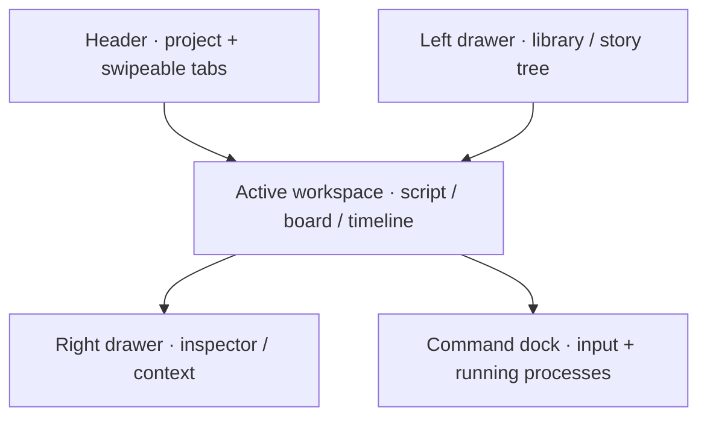

# Workspace Shell

## Purpose

- This document is the authoritative description of Calliopa's identity, responsive workspace frame, tabs, persisted workspace state, process registry, themes, and global drag model.
- `CA_0002_BUILD_technical-architecture-and-workspace-shell` is the originating change.
- All shell tasks depend on the completed application foundation through `CA_0002_010`.
- The shell is the frame every later tool mounts into. It ships a placeholder workspace surface, not a content model or real story-development tool.

## Identity

* The application name is `Calliopa`.
* The laurel from `web` (`/home/calliopa/projects/web/public/laurel.png`, 135×177) is the mark. It is copied into this repo and serves as favicon, touch icon, and header mark, so the mark in a tab is the mark on the page.

- The wordmark follows `web`: the laurel stands in for the `C`, the remaining letters are set live, and the accessible name is the whole word.

## Frame And Scrolling

* The shell occupies the viewport height and does not scroll as a whole.
* The header and the command dock remain visible whatever any region holds.
* The left drawer, the workspace, and the right drawer each scroll their own content, and scrolling one moves nothing in the other two.

- The frame is stated once for both form factors. A bounded frame is what makes independence mean anything: while the page itself can scroll, every region moves together no matter what each one declares.
- A region whose content fits does not scroll and shows no scrollbar. Scroll arrives from overflow, not from being a region.
- The regions scroll vertically. Horizontal overflow belongs to the content that has it — the tab strip, a view's own bar, a wide table — rather than to the region around it.
- The region is the scroll container, so a mounted view is handed a bounded height and sizes itself against it. [Block Editor View](../documents/block-editor.md) already describes a surface that scrolls under its bar; this is the height that surface has.
- The workspace region holds no chrome of its own that stays put. Everything it holds scrolls with the view, including the `Open in <view>` group and the context actions that render after the host. A bar that stays at an edge while content passes under it belongs to the view that owns the content.
- The frame is bounded with `dvh` and a `vh` fallback, so the page itself never scrolls and the header and dock rows stay put. The viewport meta carries `interactive-widget=resizes-content`, so an on-screen keyboard shrinks the frame rather than covering the dock. The mobile dock's sticky position is gone with the page scroll it worked around (`CA_0014_001`).
- The three regions bound their own content. `.drawer` and `.block-surface` had always declared their overflow and never scrolled, because nothing above them bounded a height; the frame is what they were missing, so this added no overflow rules to them. Each region takes vertical overflow only, and horizontal overflow stays with the content that has it (`CA_0014_002`).
- The workspace lays its host out as a column and hands it the region's height, so a view that manages its own scrolling gets a definite height to manage. The block editor spends it on the surface that scrolls under its bar, which is why the block editor never makes the region itself scroll; a view that manages no height overflows the region instead (`CA_0014_002`).
- The workspace region carries a tab stop, as both drawers already did. A region that is a scroll container is reachable from the keyboard whether or not the view mounted in it happens to overflow today, and the shell does not assume every future view will manage its own height (`CA_0014_003`).
- On a phone both header rows stay above the scrolling workspace: the identity row and the tab strip. This follows from the bounded frame rather than from a rule of its own, because the header is a grid row and only the middle regions scroll (`CA_0014_004`).
- `tests/browser/layout.spec.ts` drives scroll with the wheel over a region and asserts what moved on screen, rather than naming the element that scrolled. Which element is the scroll container is the view's business, so a test naming one would assert the arrangement instead of the promise that the document moves and the chrome does not.
- The scenarios in that file measure where things are, so the helper that measures waits for its element to be visible first. A bounding box is a point-in-time read with no auto-wait, so every measurement was racing whatever happened to be laid out at that instant.
- Finding the element and then finding it gone is a second race, and a real one: [Block Editor View](../documents/block-editor.md) keys a row by revision, so saving a block replaces its node rather than mutating it. A measurement of a live document has to tolerate the row being rebuilt underneath it, because being rebuilt is what the editor means to do.
- Browser-scenario failures on this machine are not all the same thing, and load is one of them. Gate runs that failed scenarios with timeouts and `socket hang up` coincided with a load average above twenty, from a sibling repository's verification stack running at the same time; the same runs passed once the machine was quieter. A failing browser scenario is therefore worth reading before it is worth believing, and the load average belongs in that reading.
- What made the mobile scrolling scenario fail intermittently was the row being replaced, not a flash of nothing and not `.first()` matching nothing. Tagging the live node, saving, and asking whether the tag survived answered it: the tag was gone and the row count was unchanged, so one node had replaced another. The measurement was reading across a re-render the editor performs on purpose, and it now retries rather than treating the gap as a failure.
- What that experiment does not settle is whether a reader ever sees the gap. Nothing observed suggests one — the count never fell to zero — but a visible flash would need the removal and the insertion to straddle a paint, and that was not measured. It is worth measuring only if someone reports seeing it.
- The workspace region publishes its inset as a named value, so a view that means to reach the region's own edges negates exactly it rather than repeating the desktop number and the phone one and drifting from them at the breakpoint. The region does not know which views negate it, so it still holds no chrome of its own and no view takes ownership of a shell surface. [Block Editor View](../documents/block-editor.md) is the first consumer (`CA_0027_001`).
- [ ] CA_0014_005 Restore each tab's scroll position across a tab switch, making the fixed line in [Tabs](./tabs.md#tabs) true for the first time. The scroll container it needs now exists. This is deliberately outside `CA_0014`'s closure: bounding a region and remembering an offset are different work, and the offset carries its own decision. Scroll stays browser-local, as that section's second fixed line requires, so nothing here reaches the workspace record. Decide what a restored offset means when the document changed underneath — a stored pixel offset into a document whose blocks moved points somewhere else — and prove a tab returning to where it was left, a tab never scrolled arriving at the top, and a changed document not restoring to a position that no longer exists. Depends on `CA_0014_002`.

## Qwik Boundaries

- Qwik City manages workspace routes and resumable loading boundaries.
- One workspace shell component owns layout, drawers, tabs, command dock, and global drag coordination.
- A mounted view reaches the shell through one declared bridge and nothing else: the live drag state, an inspector contribution, a dock action contribution, and the means to start a drag, record the tab's selection, rename its target, report its save state, say its target is gone, and raise a message. The shell renders those surfaces; a view never owns one.
- A drop landing on a target the shell does not own is handed to the mounted view rather than interpreted by the shell. The shell resolves the gesture; the view decides what the drop means for its own content.
- Individual tools mount inside tab contexts; this change ships only a placeholder workspace surface proving the tab-context contract.
- Shared process state lives above individual tabs.
- A QRL closure captures only the identifiers its body references. State read in a default parameter expression is not lifted, so the closure throws when it runs; captured signals and stores are read inside the body.
- A handler that acts on the active tab reads it from the tab store instead of capturing it, because a closure created on an earlier render still names the tab that was active then.
- A QRL closure may read module-level state but must never assign to it. Qwik extracts each QRL into its own chunk that imports what the closure captured, and assigning to an import is illegal in a module, so a mutable module variable a closure writes fails the production build while the typecheck and the fast check both pass. Browser-local state a closure writes lives in a signal instead, wrapped in `noSerialize` when it names a live element.
- A QRL closure may only capture serializable values, so a helper that several handlers call lives at module scope rather than in the component body. A plain function declared beside the handlers is captured rather than imported, and the render fails at runtime naming that function while the typecheck and the fast check both pass.
- A task that fetches is a visible task. `useTask$` also runs while the page is rendered on the server, where a relative API address resolves against nothing, so a view's first read lives in `useVisibleTask$` and `useTask$` is left to react to state already in hand.
* Tabs own working context, items own durable content, processes own asynchronous execution, and the shell coordinates them without merging them into one state object.

## Out Of Scope

- Real tools, AI requests, uploads, process producers, story content records, authentication, users, collaboration, and a workspace list arrive through their own changes.
- The composer accepts text but has no command backend.
- The left drawer ships with nothing at all: no node kinds, no records, and no heading. Story records and the node kinds they carry arrive with the content model.

## Implementation

- The copied 135×177 laurel is the favicon, touch icon, and header wordmark's accessible `C`; the remaining `alliopa` letters are live text. `Calliopa` is the document title and heading, and Playwright proves every identity surface and asset (`CA_0002_011`).
